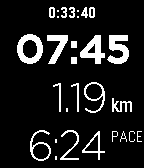
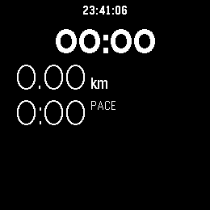

# Pebble Run Tracker

This is a run / walk tracker for Pebble with a focus on simplicity.
It doesn't require a companion app but it does require a connection to a phone for GPS.

Supports all Pebble watches, including the 2026 models.

## Screenshots
Pebble Time, Pebble Time Steel, Pebble 2, Pebble 2 Duo:  
 

Pebble Round 2:  

## Features

The app shows the time, distance and pace of your run as well as the wall time.
Press Select to start/pause/resume your run.
While running, it shows your current pace. Wile paused, it shows your overall (average) pace.
The app doesn't save any data about your previous runs.
At the moment, the distance can be shown in kilometers but not in miles.

## GPS Accuracy

The Pebble watch doesn't have GPS so it needs to use your phone to get the current position.
It seems that Pebble can query the current position but can't trigger a precise GPS lock.
The location will be inaccurate unless another app on the phone is requesting the location.
Therefore, I recommend that you use a separate app on your phone, such as Strava or Google Fit, to record an activity to ensure that precise location data is available.
